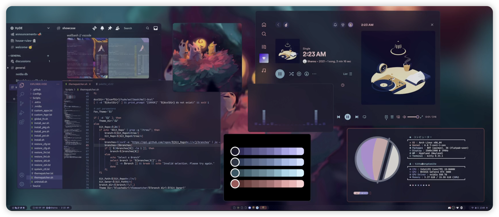
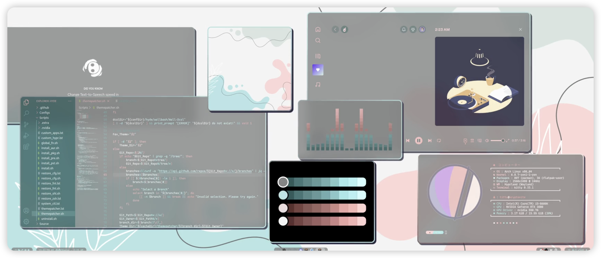

# ArchLinux Hyprland 主题安装

## 前言

Hyprland 有很多大佬打包好的主题，可以直接抄来用，也可以自己安装插件，自己设计美化，对于懒人来说，找个佬的省时省力。

我使用并且推荐的是这一款

- [Hyprdots 主题](https://github.com/prasanthrangan/hyprdots)   

其他的主题交给读者自行寻找。

## 预览图

<div align = center>

</div>
<div align = center>

</div>

## 安装

- [Github Hyprdots 主题](https://github.com/prasanthrangan/hyprdots)
- [Youtube Hyprland 主题安装教程](https://www.youtube.com/watch?v=otwnzco0HmM)

```bash
# 设置下载文件夹，无需参考
cd ~
sudo mkdir Downloads
# 下载主题
git clone https://github.com/prasanthrangan/hyprdots.git
# 进入主题文件夹
cd hyprdots
# 安装主题
sudo ./install.sh
```

根据安装程序提示进行安装就可以了。`clean Build` 选 `N`，
`diff` 选 `N`。

注意网络问题，见上一章节。

等待全部安装完成，重启即可。

## 配置

### 修改主题

```bash
# 进入主题文件夹
sudo vim ~/.config/hypr/hyprland.conf
# 修改主题配置文件
# 添加如下内容 
env = LIBVA_DRIVER_NAME,nvidia
env = XDG_SESSION_TYPE,wayland
env = GBM_BACKEND,nvidia-drm
env = __GLX_VENDOR_LIBRARY_NAME,nvidia

cursor:no_hardware_cursors = true
```

其余的 `monitor` 显示器等配置，参考官网 `wiki` 即可。

- [Hyprland wiki](https://wiki.hyprland.org/Configuring/)

## sddm 启动问题

一般来说，安装完以后启动界面也会被更改为适配主题，但是不知道为什么我的没有修改，不过通过自行修改 `sddm` 配置文件，也可以实现。

安装 `theme` 主题，我比较推荐这两款：

- [宇航员主题](https://github.com/Keyitdev/sddm-astronaut-theme)
- [Suger-dark](https://github.com/MarianArlt/sddm-sugar-dark)

```bash
# 下载主题包到配置目录
git clone  /usr/share/sddm/themes
# 进入 sddm 配置文件夹
sudo vim /usr/lib/sddm/sddm.conf.d/default.conf
# 找到并修改如下内容
[Theme]
Current=<Download themes'name>
```

重启即可。