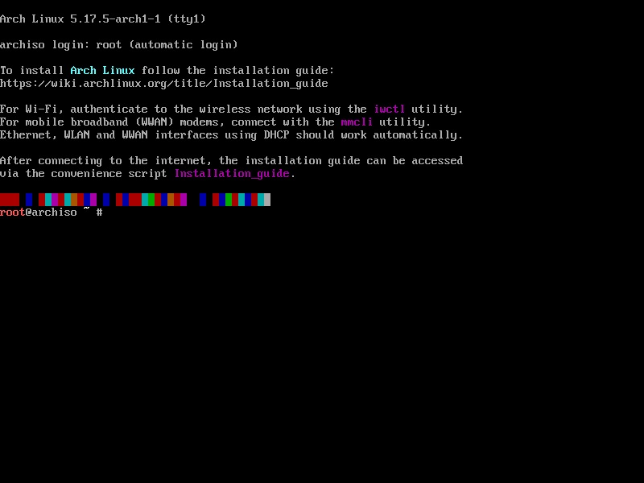
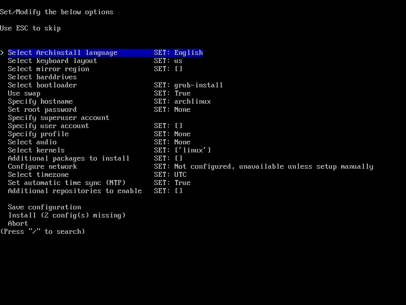

# ArchLinux 基础安装与配置

## 前言

之前在 Zorin 系统下遇到了 Docker 的一个 bug，一直解决不掉，遂暴起直接格式化重装系统。想着顺便换个 Linux 发型版玩玩，在 Arch 和 Fedora 中最后还是选择的 Arch，主要是看上了 Hyprland + Arch 的组合，有点香。

> ❗️❗️在正式开始前，你要确定你有十足的时间来进行漫长的 Debug 与调试。

本文以及接下来相关的 Arch Linux 系列文章主要内容为：

1. ArchLinux 基础安装与配置
2. ArchLinux Hyprland 主题安装
3. ArchLinux CUDA 等显卡适配

有需要的童鞋可以参考我的经历，减少踩坑。

基本信息：
- CPU: Intel Core i5
- GPU: Nvidia GTX 4060
- 硬盘: 1TB NVMe SSD
- 内存: 16GB DDR4 3200MHz
- 安装系统: Arch Linux 5.15.53-1 (x86_64)

相关链接：
- [Arch Linux 官网](https://archlinux.org/download/)
- [Arch Linux Wiki](https://wiki.archlinux.org/title/Installation_guide)
- [Arch Linux 安装指南](https://arch.icekylin.online/guide/)
- [使用 archinstall 安装 Arch Linux 和 KDE 桌面环境](https://u.sb/archlinux-archinstall/)

## 1. 准备工作

### 1.1 下载 ArchLinux iso文件

- [ArchLinux 官网](https://archlinux.org/download/)
- [ArchLinux 镜像网站](https://mirrors.tuna.tsinghua.edu.cn/archlinux/iso/latest/)

点击下载自己系统架构的 iso 文件即可。

### 1.2 制作启动盘

我们使用 Rufus 制作 U盘镜像文件。

> Rufus 是一款格式化和创建 USB 启动盘的辅助工具。
本软件适用于以下场景：
需要将可引导 ISO (Windows、Linux、UEFI 等) 刻录到 USB 安装媒介的情况
需要处理未安装操作系统的设备的情况
需要在 DOS 环境下刷写 BIOS 或其他固件的情况
需要运行低级工具的情况
Rufus 麻雀虽小，但五脏俱全！

官方网站： [https://rufus.ie/zh/](https://rufus.ie/zh/)

安装好后，插入准备好的U盘（2G以上），使用 Rufus 将刚下载好的 iso 导入即可。

### 1.3 检查 BIOS/UEFI

确定 U盘启动为优先项，或者在引导界面选择 U盘启动，这里不再赘述。

## 2. 安装 ArchLinux

### 2.1 使用手工安装 ArchLinux

适合对 Linux 有一定了解的用户，这里不使用手工安装。

有需要的可以参考此链接：

- [Arch Linux Wiki](https://wiki.archlinux.org/title/Installation_guide)
- [Arch Linux 安装指南](https://arch.icekylin.online/guide/)

### 2.2 archinstall 自动安装

在 U盘加载完毕后，进入初始界面：

<div align = center>

</div>

#### 网络测试

使用此命令测试网络是否正常。

```bash
ping -c 3 www.baidu.com
```

一般来说，如果是有线连接，无需更多操作。

如果为无线网，则按照一下流程进行操作：

```bash
rfkill unblock wifi # 部分电脑会限制无线网卡，使用此命令解除限制
iwctl # 进入交互式命令行
device list # 列出无线网卡设备名，比如无线网卡看到叫 wlan0
station wlan0 scan # 扫描网络
station wlan0 get-networks # 列出所有 wifi 网络
station wlan0 connect wifi-name # 进行连接，注意这里无法输入中文。回车后输入密码即可
exit # 连接成功后退出
```

> tips：使用 clear 可以清除当前屏幕的输出内容。

#### archinstall

直接输入 archinstall 进入可视化安装程序。

<div align = center>

<p>
（图片内容较久远，参考即可）
</p>
</div>


可以看到类似这样的画面，方向键选择，回车确定，选择界面输入 '/' 可以查询匹配。

在这里需要关注的内容如下：

- `Mirror Region`：选择镜像源，这里选择 China

- `Select harddrives` 或者 `Disk configuration`：`windows` 双系统的同学参考一下其他资料。我已经格式化了所有内容，直接一路回车点到底就好了。（自动分区-btfs）

- `Hostname`：设置主机名，自己设定就可以了。

- `Root Password`：设置 `root` 密码。

- `User Account`：设置用户名和密码，并且选择是否成为 `sudo` 用户。记得 `confirm and exit` 才会保存。

- `Profile`：`Type` 选择 `Desktop`，桌面选择 `Hyprland`，你也可以选择 `KDE`，自行了解不同，下一步选第一个，出去以后记得选择 `nvidia` 专用驱动（高版本GPU）自行了解 GPU 配置。

- `Audio`：选择 `Pipewire`。

- `Network configuration`：选择 `Use NetworkManager` 既可。

- `Time Zone`：选择时区，这里选择 `Asia/Shanghai`。

❗️❗️请多次检查，确认无误后，选择 `Install` 进行安装。双系统的话还需要进行 `grub` 的配置，这里不再赘述。

安装结束后，选择 `No`，直接输入 `reboot` 重启，之后应该可以进入 `Hyprland` 的桌面页面。

具体显示为：上方黄色框，里面有内容提示。

不出意外的话，显示器应该会闪烁，画面撕裂，这是因为 `Hyprland` 对 `Nvidia` 还需要进行额外的配置。

## 3. Nvidia 配置

> 

- [Hyprland Nvidia配置](https://wiki.hyprland.org/Nvidia/)

`ctrl + alt + F3` 进入 `tty3`，不要使用 root 账号登录

```bash
# 找到 MODULES 行，添加如下内容
sudo vim /etc/mkinitcpio.conf
MODULES=(... nvidia nvidia_modeset nvidia_uvm nvidia_drm ...)
# 找到 HOOKS 行，删除 Kms
HOOSK=(... Kms ...)
```

```bash
# 创建并且添加如下内容
options nvidia_drm modeset=1 fbdev=1
```

```bash
# 更新文件，重启
sudo mkinitcpio -P
reboot
```

再次进入桌面系统，应该已经解决了画面闪烁问题。

可以使用如下检查是否设置 ```nvidia_drm.modeset=1``` 成功

```bash
cat /sys/module/nvidia_drm/parameters/modeset
# Y
```

`super + Q` 可以打开 `Kitty` 命令行。

## 4. 网络配置

### 4.1 pacman 基础配置

`pacman` 是 Arch Linux 的包管理器，类似于 `apt`，`yum`，`dnf`，`zypper` 等。

#### 吃豆人与彩色设置

```bash
# 找到 /etc/pacman.conf 文件
sudo vim /etc/pacman.conf
# 找到 Color 行，取消注释，添加一行
Color
ILoveCandy
# 退出更新
sudo pacman -Syy
```

命令行应该会出现彩色，并且使用 pacman 安装包时，会显示吃豆人进度条。

```bash
[ -C o o o o o o o ] 
```

#### 添加国内镜像源

```bash
# 找到 /etc/pacman.conf 文件
sudo vim /etc/pacman.conf
# 在最后添加如下内容
[archlinuxcn]
Server = https://mirrors.tuna.tsinghua.edu.cn/archlinuxcn/$arch
# 安装 archlinux-keyring
pacman-key --lsign-key "farseerfc@archlinux.org"
sudo pacman -S archlinuxcn-keyring
```

#### 安装 yay

> yay 是一个 AUR 帮助工具，类似于 `apt` 的 `apt-get`，`yum` 的 `yumdownloader`，`dnf` 的 `dnf download`，`zypper` 的 `zypper download`。

> AUR 是 Arch Linux 用户仓库，类似于 Ubuntu 的 `PPA`，`Fedora` 的 `Fedora EPEL`，`Debian` 的 `Debian Backports`，`CentOS` 的 `EPEL`。

```bash
# 安装 yay
sudo pacman -S yay
```

### 4.2 Clash 代理

#### 安装 Clash

```bash
# 安装 Clash
sudo pacman -S clash
```

#### 配置 Clash

```bash
# 创建 Clash 配置文件，写入配置文件，路径可以自定义
sudo vim ~/.config/clash/config.yaml
# 或者直接导入订阅链接
wget "机场给你的订阅链接" -0 ~/.config/clash/config.yaml
```

```bash
# 输入 clash 启动
clash
# return your configs
```

#### 安装 yacd 可视化 Web 界面

```bash
# 直接安装在 Clash 文件目录下
git clone https://github.com/haishanh/yacd.git ~/.config/clash/dashboard
# 修改配置文件
sudo vim ~/.config/clash/config.yaml
# 添加 external-ui 配置项，修改为
external-ui: dashboard
external-controller: 0.0.0.0:9090
```

退出，重启 Clash

```bash
# 重启 Clash
sudo systemctl restart clash
```

#### 配置系统代理

如果你有 `zsh` 和 `bash` 两个 `shell`，可以直接修改 `profile` 文件，也可以分别修改 `.zshrc` 和 `.bashrc` 文件。

```bash
# 修改 /etc/profile 文件，添加如下内容
export http_proxy="http://127.0.0.1:7890"
export https_proxy="http://127.0.0.1:7890"
export all_proxy="socks5://127.0.0.1:7891"
```

设置为系统代理

```bash
# 修改 /etc/environment 文件，添加如下内容
http_proxy="http://127.0.0.1:7890"
https_proxy="http://127.0.0.1:7890"
all_proxy="socks5://127.0.0.1:7891"
```

```bash
# 测试网络
curl www.google.com
# return html
```

目前基本的功能已经实现，下一步将使用他人打包好的 `Hyprland` 文件进行安装，如果自己有能力，可以选择自己安装插件美化。如果自行安装插件记得 `Hyprland Nvidia` 还有一步需要设置。

- [Hyprland Nvidia](https://wiki.hyprland.org/Nvidia/)