# Ubuntu系统深度学习环境搭建

## 前言

本文为本人搭建完 Ubuntu 双系统后搭建深度学习环境的过程记录。

> 1. 更新于 12/6 ，发现 Ubuntu 22.04 版本以后使用命令行安装 Nvidia 会出现开机黑屏，只有左上角有一个光标在闪烁。删除原先 1.2 内容。

## 1. Nvidia 安装

* 在安装完成后记得先去将下载源换成国内源。

安装完 Ubuntu 以后，系统默认使用了一个开源的公共显卡驱动，我们要使用 Nvidia 作为我们的驱动。

### 1.1 禁言默认显卡驱动

```
sudo nano /etc/modprobe.d/blacklist-nouveau.conf
```

在打开的文件夹中，输入以下内容禁用 Nouveau 驱动：

```
blacklist nouveau
options nouveau modeset=0
```

Ctrl+x + y + enter 保存并退出。

更新initramfs：

```
sudo update-initramfs -u
```

重启计算机：

```
sudo reboot
```

重启后打开命令行输入：

```
lsmod | grep nouveau
```

如果没有任何信息弹出说明禁用成功。

### 1.2 安装 Nvidia 显卡驱动 （已废弃）

输入以下命令可以查看仓库可以安装的驱动：

```
ubuntu-drivers devices
```

如果有特殊显卡驱动版本要求的按照提供的版本安装即可，这里使用最简单的方法，让系统自动选择，输入以下命令自动安装：

```
sudo ubuntu-drivers autoinstall
```

安装过程中可能会出现一个图形化界面，要求输入密码，这个密码是自己设置的一个密码，记住就行，输入密码看不见是正常的。操作是用方向键或者TAB，Enter。

等待安装结束，我们 reboot 重启。

**最最最最坑的地方来了，我一直卡在这里，也没找到什么大论坛会谈论这个细节！！！**

此时如果安装成功，开机界面会出现一个蓝色界面：

不要选择 Continue boot！！选择 Enroll MOK，回车确定。

<div align = center>
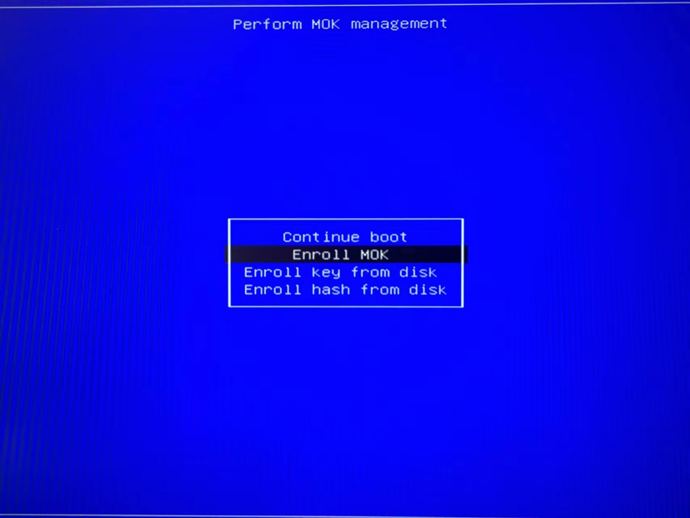
<p>图 1.1</p>
</div>

选择 Continue，

<div align = center>
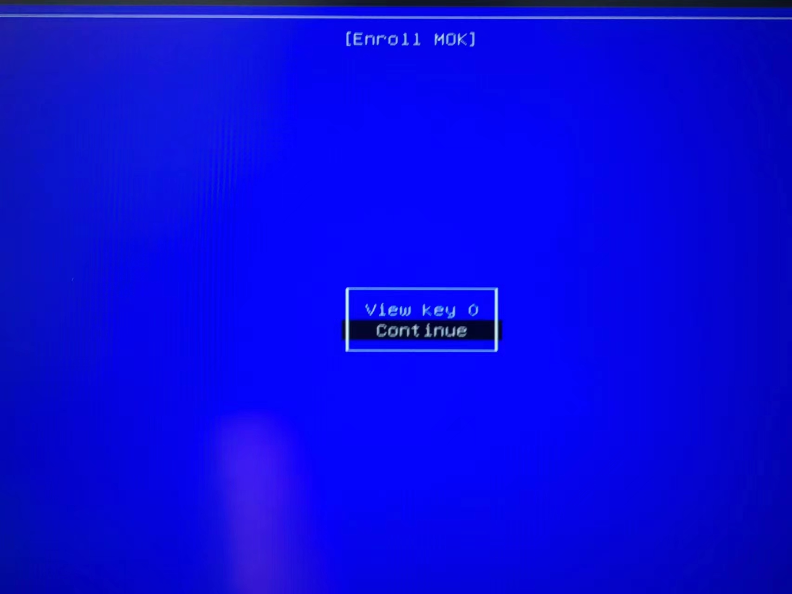
<p>图 1.2</p>
</div>

选择 Yes，

<div align = center>
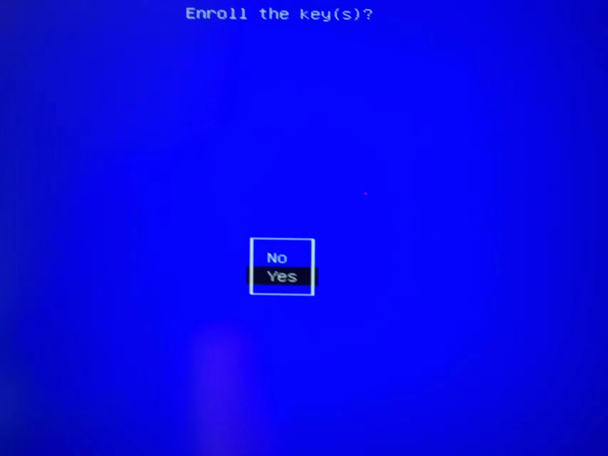
<p>图 1.3</p>
</div>

输入你在安装 Nvidia 时输入的密码，

<div align = center>
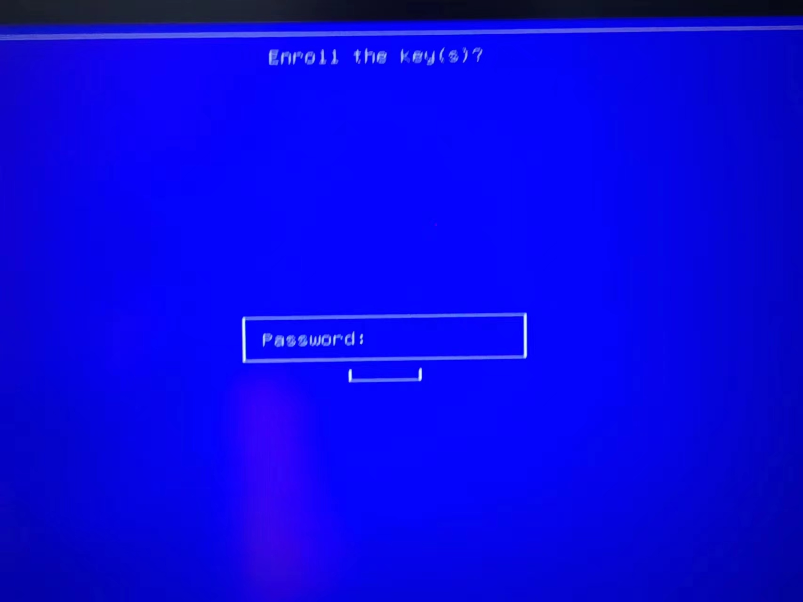
<p>图 1.4</p>
</div>

最后选择 Reboot。

<div align = center>
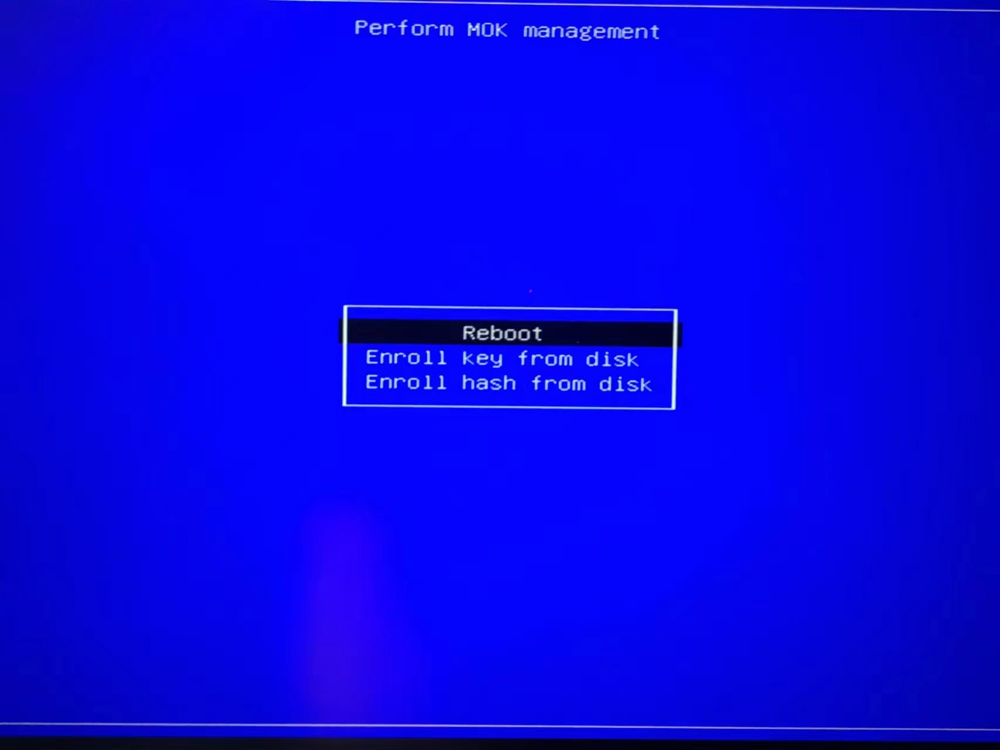
<p>图 1.5</p>
</div>

这样开机重启以后，Nvidia 显卡才算是安装完成了。

打开命令行，输入 nvidia-smi，如果能正常弹出显卡信息，说明安装成功了。

## 1.2 安装 Nvidia 显卡驱动

打开 Ubuntu 系统中的 Software & Update（软件与更新）软件。

打开点入 Additional Drivers（额外驱动），联网状态下会显示当前可以使用的显卡驱动版本，任选其一即可，可以选择带 proprietary（专门）的。

选择后点击右下角 Apply Changes （应用更改），重启即可。

<div align = center>
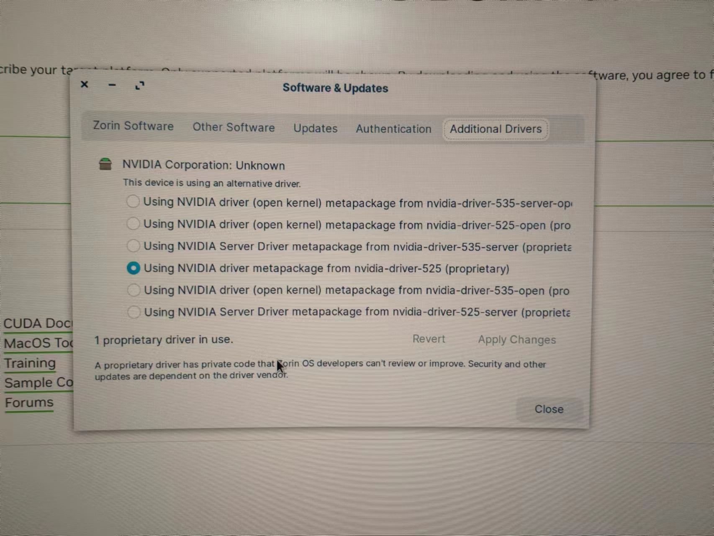
<p>图 1.1</p>
</div>

打开命令行，输入 nvidia-smi，如果能正常弹出显卡信息，说明安装成功了。

## 2. CUDA 安装

进入 CUDA 官网：

- [https://developer.nvidia.com/cuda-downloads](https://developer.nvidia.com/cuda-downloads)

仍然还是建议下载 11.8 版本以前的，以前的版本在网页下面链接 **Archive of Previous CUDA Release** 中找。

注：没有科学上网的话访问 CUDA 页面非常慢，可能网页上部分是空白的，只能等咯，建议学习一下科学上网或者找一下有没有国内镜像。正常的网页如下：

<div align = center>
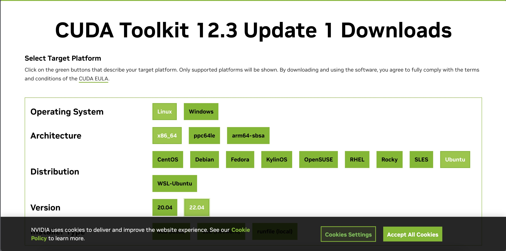
<p>图 2.1</p>
</div>

按照自己的系统选择完毕后有几个文件可以选择下载，建议可以下载 .run 文件，简单易操作，注意运行前最好给予文件权限：

```cmd
sudo chmod 777 xxx.run
sudo ./xxx.run
```

<div align = center>
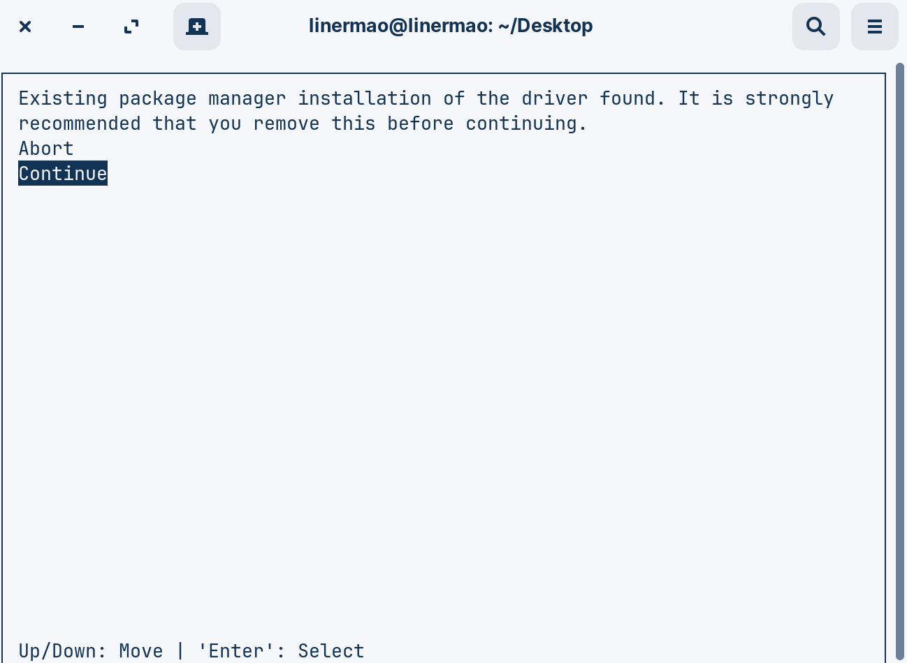
<p>图 2.2</p>
</div>


<div align = center>
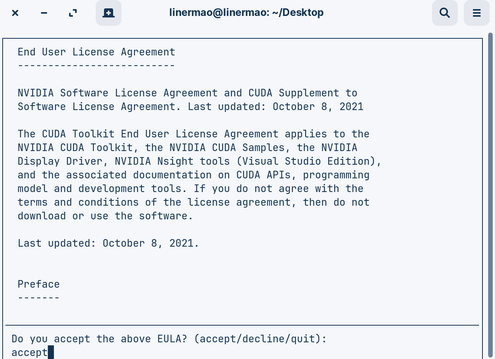
<p>图 2.3</p>
</div>

注意由于我们已经安装了显卡驱动，所以在安装过程中第一项不要勾选，Enter 取消就可以了。

<div align = center>
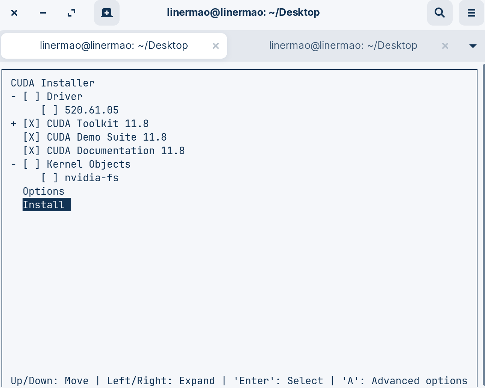
<p>图 2.4</p>
</div>

能够弹出这样的信息就可以了，然后按照他的提示修改环境变量：

```cmd
sudo vim ~/.bashrc
# 有的可能没有预装 vim ，可以使用 vi ，操作一样的，可以了解一下 vim 是什么
# sudo vi ~/.bashrc
# 找到空位添加下面内容，vim 和 vi 中先键入 i 进行输入，输入结束后按 esc 退出输入，然后输入 :wq 保存并退出，如果出现了一些奇怪的输入错误，可以输入 :q! 进行强制退出
export PATH=$PATH:/usr/local/cuda/bin
export LD_LIBRARY_PATH=$LD_LIBRARY_PATH:/usr/local/cuda/lib64
# 输入 :wq 保存退出，更新文件
source ~/.bashrc
# 检查是否成功
nvcc -V
```

如果能够弹出一系列信息说明成功。

## 3. cuDNN 安装

进入 cuDNN 官网：

- [https://developer.nvidia.com/cudnn](https://developer.nvidia.com/cudnn)

首先先安装 zlib：

```cmd
sudo apt-get install zlib1g
```

安装 cuDNN 是比较麻烦的，首先你需要有一个 Nvidia 的账号，按照指示注册就好，然后在安装界面我们选择 Download cuDNN Library ，选择自己系统对应的版本等待下载完成即可。

<div align = center>
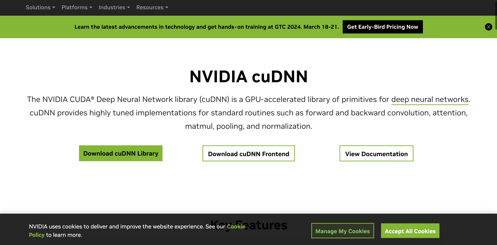
<p>图 3.1</p>
</div>

```shell
# 检查是否成功
cat /usr/local/cuda/include/cudnn.h | grep CUDNN_MAJOR -A 2 
# or
cat /usr/local/cuda/include/cudnn_version.h | grep CUDNN_MAJOR -A 2 
```


## 4. Miniconda 安装

Miniconda 和 conda 有什么区别？没什么区别，miniconda 只包含了 conda 内核，按需选择。

进入 Miniconda 官网：

- [https://docs.conda.io/projects/miniconda/en/latest/](https://docs.conda.io/projects/miniconda/en/latest/)

选择系统对应的即可。

**注意**：下载完成后记得 chmod 给权限！！否则可能会出现安装后 conda command not found。

安装时输入 sudo apt-get install -y XXX 或者读用户许可的时候按 q 就可以跳过许可了。其他全部默认 enter 就可以了。

安装完成后重启终端，如何前面出现一个 (base) 说明安装成功，如果没有则输入：

```cmd
conda init
```

如果提示 conda command not found，恭喜你，开始上网找资料吧。

经验来说，修改 /.bashrc 中的环境变量即可成功，还望读者自行探索。